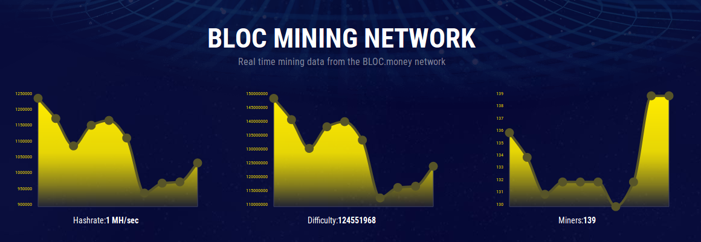

# **What is a mining pool ?**

A mining pool is a joined group of cryptocurrency miners who share their processing power over a network, to split the reward equally, according to the amount of work they contributed to the probability of finding a block. A “share” is awarded to members of the mining pool who present a valid partial proof-of-work. 

So unless you want to solo mine, which is unfeasible for many people, you will need a pool to mine towards. Make sure to choose the one closest to you!

## **Kriegerrand Mining Network**

You can find a complete list of the Kriegerrand mining pools available on the [Kriegerrand MINING](https://bloc.money/mining) section of our website.

### Official Mining Pools

Built and maintain by the official [Kriegerrand Team](https://bloc.money/mining)

### Community Mining Pools

Built and maintain by the [Community](https://bloc.money/mining)

## **Definition of Fees**

Rather simple; the pool operator will take a percentage of the reward of the block found for himself.

Example-

- the fee is 0.1%
- the block reward is 20 BLOC
- 20 x 0.1% = 0.02 BLOC

Therefore, the pool operator will take 0.02 abLoc for himself.

## **Add your mining pool**

Do you have a mining Pool for **KREGR** ?
Would you like to be added to the official mining pools list on the Kriegerrand MONEY website [here](https://bloc.money/mining) ?
Just contact us using our social media accounts or simply by email.